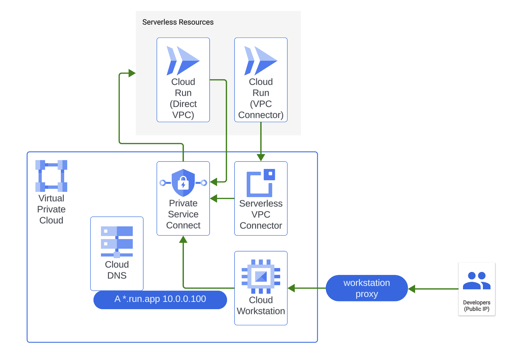

# Cloud Run Networking Demo

## Introduction

This blueprint contains a Terraform demo to build and __privately__ expose a Cloud Run service in a variety of use cases.

The content of this blueprint corresponds to the chapter '_The corporate environment - Developing an enterprise application_' of the [__Serverless Networking Guide__](https://services.google.com/fh/files/misc/serverless_networking_guide.pdf). This guide is an easy to follow introduction to Cloud Run, where a couple of friendly characters will guide you from the basics to more advanced topics with a very practical approach and in record time! The code here complements this learning and allows you to test the scenarios presented and your knowledge.

## Prerequisites

* terraform version >1.7.4
* gcloud
* a Google Cloud project where you have project admin IAM permission

## Spinning up the architecture

### General steps

1. Clone the repo to your local machine or Cloud Shell:

```bash
git clone https://github.com/thinhha/cloud-run-dev-demo
```

2. Change to the directory of the blueprint:

```bash
cd cloud-run-dev-demo
```

You should see this README and some terraform files.

3. To deploy a specific use case, you will need to create a file in this directory called `terraform.tfvars` and set the corresponding variables to include an existing Google Cloud project where you have project admin permissions over, and the region where you want to deploy your resources. E.g.:

```tfvars
project_id = "[your-project_id]"
region = "[europe-west3]"
```

may become

```tfvars
project_id = "spiritual-hour-331417"
region = "europe-west3"
```

4. The usual terraform commands will do the work:

```bash
terraform init
terraform plan
terraform apply
```

It will take a few minutes. When complete, you should see an output stating the command completed successfully, a list of the created resources, and some output variables with information to access your services.

### Access to Cloud Run from a VM in the project

This use case deploys two Cloud Run services (one using [VPC Connector](https://cloud.google.com/run/docs/configuring/vpc-connectors) and one using [direct VPC egress](https://cloud.google.com/run/docs/configuring/vpc-direct-vpc)) and a [Cloud Workstation](https://cloud.google.com/workstations/docs) VM in the same project. 

To privately access Cloud Run from the VM, PSC is used. A PSC endpoint is created so that the VM can reach the service through an RFC1918 IP. Also, a DNS entry is created to point the service's default URL to that IP.

<p align="center">  </p>

The default URL is automatically created by Cloud Run and shown as a terraform output variable. Replace the variable `RUN_VPC_CONNECTOR` with the URL returned by Terraform. 

When you are using your workstation machine and run `curl` against the endpoint, you should see the following:

```bash
$ RUN_VPC_CONNECTOR=https://hello-vpc-connector-<unique-id>.a.run.app
$ curl -H "Authorization: Bearer $(gcloud auth print-identity-token)" -v "${RUN_VPC_CONNECTOR}"
*   Trying 10.0.0.100:443...
* TCP_NODELAY set
* Connected to hello-vpc-direct-hvzy5ukw3a-nw.a.run.app (10.0.0.100) port 443 (#0)
...
```

Note that the VM is resolving the Cloud Run service to an internal IP, 10.0.0.100. Public access is restricted, if you try to `curl` the endpoint from e.g. your laptop you will get a `403 Forbidden` error.

### Proxy Cloud Run endpoint to localhost for development

The easiest way for you to test private services is to use the [Cloud Run proxy in gcloud CLI](https://cloud.google.com/run/docs/authenticating/developers#testing). This proxies the private service to http://localhost:8080 (or to the port specified with --port), providing the token of the active account or another token you specify. This lets you use a web browser or a tool like curl. This is the recommended way to test privately a website or API in your browser.

You can proxy a service locally using the following command:

```
gcloud run services proxy hello-vpc-connector --project "${MY-PROJECT-ID}" --region="${MY-REGION}"
```

## Cleaning up your environment

The easiest way to remove all the deployed resources is to run the following command:

```bash
terraform destroy
```

The above command will delete the associated resources so there will be no billable charges afterwards. Projects are removed from Terraform state but not deleted from Google Cloud.
